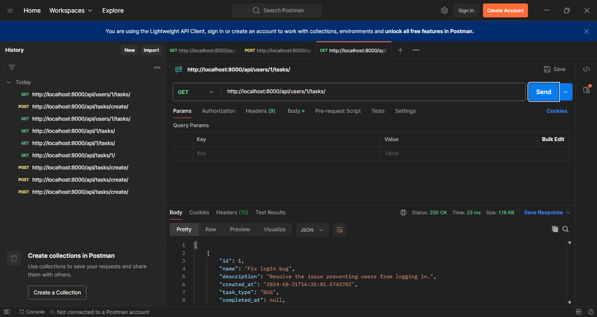
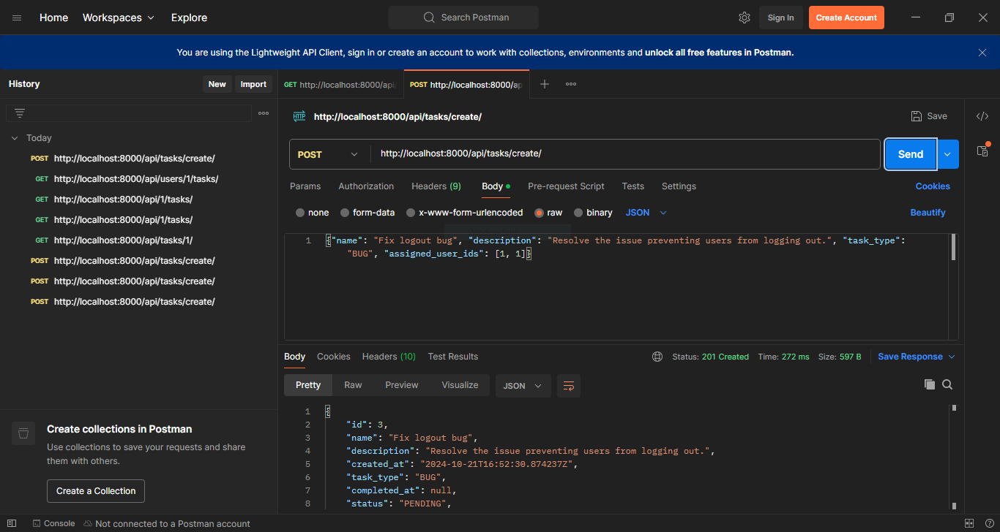
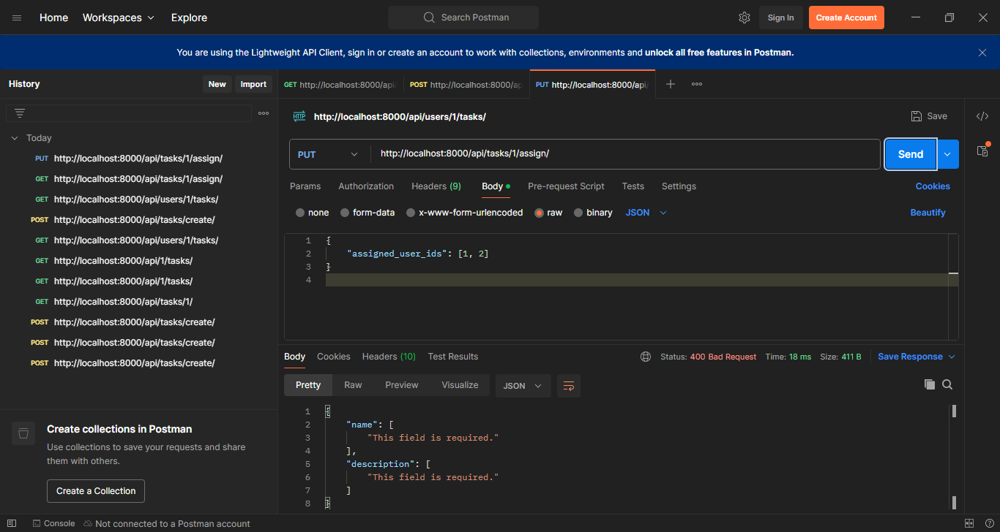

# Task Management API

## Overview
A RESTful API built with Django and Django Rest Framework for managing tasks, assigning them to users, and retrieving tasks based on user assignments.

## Features
- Create tasks with a name and description.
- Assign tasks to one or multiple users.
- Retrieve all tasks assigned to a specific user.

## Requirements
- Python 3.12
- pip 23.2.1
- Django 5.1.1
- Django Rest Framework 3.15.1

## Setup

1. **Clone the Repository**
   ```bash
   echo 'git clone <repository-url>'
   git clone https://github.com/Preet-Govind/API_Task_Manager.git
   cd task_management
   ```
## Environment
  ```python
  # Create a virtual environment
  python -m venv venv
  # Activate the virtual environment
  # On Windows:
  venv\Scripts\activate
  # On macOS/Linux:
  source venv/bin/activate
  # Install the dependencies
  pip install -r requirements.txt
  ```

## Install dependencies
  ```python
  pip install -r requirements.txt
  ```
## Apply migrations
  ```
  python manage.py makemigrations
  python manage.py migrate
  ```
## Create User
  ```
  python manage.py createsuperuser
  ```
superuser username : admin
mail : admin@mail.com
password : admin

## Python shell 
- To add user, apart from super user
	```
	from django.contrib.auth.models import User
	# Create a new user
	User.objects.create_user(username='testuser', password='testpass', email='testuser@example.com')	
	```

## Check users 	
  ```
	# Check if user with ID 2 exists
	user = User.objects.filter(id=2).first()
	print(user)  # This should print the user details or None if it doesn't exist
  ```

	
## Run server 
  ```
  python manage.py runserver
  ```

## API Endpoints

### 1. Create a Task
- **Endpoint**: `/api/tasks/create/`
- **Method**: POST
- **Request Body**:
    ```json
    {
        "name": "Task Name",
        "description": "Task Description",
        "task_type": "BUG",
        "assigned_user_ids": [1, 2]  // User IDs
    }
    ```

### 2. Assign a Task to Users
- **Endpoint**: `/api/tasks/<task_id>/assign/`
- **Method**: PUT
- **Request Body**:
    ```json
    {
        "assigned_user_ids": [1, 2]
    }
    ```

### 3. Get Tasks for a Specific User
- **Endpoint**: `/api/users/<user_id>/tasks/`
- **Method**: GET
  ## Preview
Here is a preview of the API in action:
### Task Management GET Request


### Task Management POST Request


Task Management PUT Request



